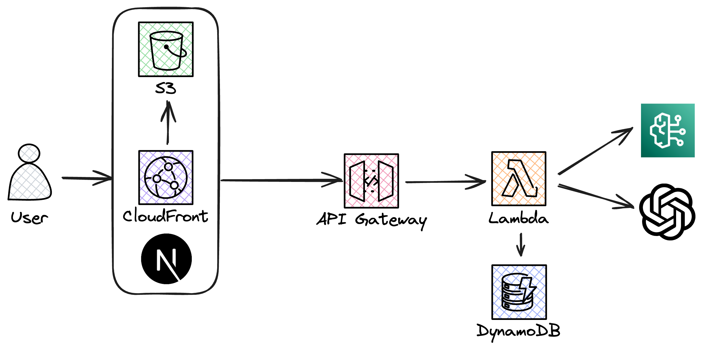

# Serverless Chat Application with Amazon Bedrock and OpenAI

Repository for the accompanying [blog post]([url](https://blog.awsfundamentals.com/amazon-bedrock-the-openai-api-and-sst)) and [newsletter](https://newsletter.awsfundamentals.com).


This project is a serverless chat application that leverages Amazon Bedrock and the OpenAI API to enhance chat functionalities with advanced AI-driven contextual understanding. Built using Serverless Stack (SST), NextJS, AWS Lambda, and DynamoDB, it offers a robust platform for real-time messaging enriched with AI capabilities.

## Architecture

Below is the architecture diagram of the application, illustrating how different components interact within the AWS environment:



## Features

- Real-time chat messaging.
- Contextual note integration for smarter responses.
- Use of Amazon Bedrock and OpenAI for natural language understanding.
- Fully serverless backend with AWS Lambda and DynamoDB.

## Prerequisites

- AWS CLI installed and configured with AWS account credentials.
- Access to Amazon Bedrock and OpenAI APIs.
- Node.js and NPM installed.

## Providing your OpenAI API key to SST

To provide your OpenAI API key to SST, use the following command:

```bash
npx sst secrets set OPENAI_API_KEY sk-Yj...BcZ
```

## Deploying with SST

To deploy the application, ensure you are in the project's root directory and then use the SST commands:

```bash
npx sst deploy
```

## Running Locally

To run the application locally, use the following command:

```bash
npx sst dev
```

Start the frontend by navigating to the `packages/app` directory and running:

```bash
npm run dev
```
